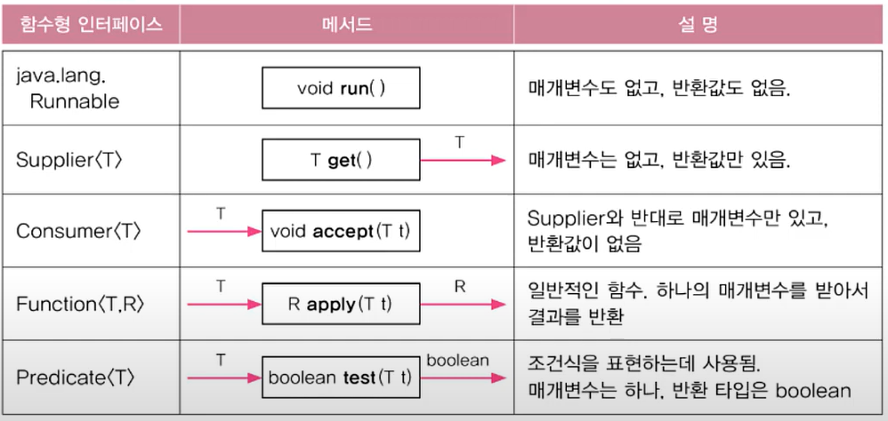
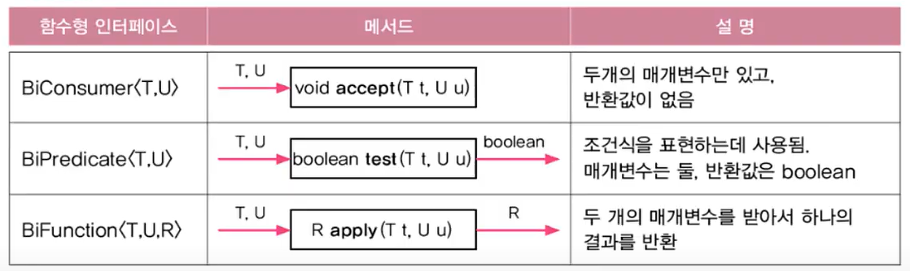
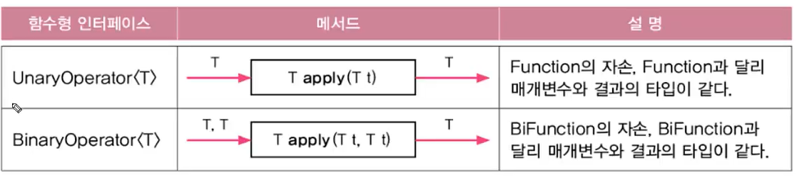

# 함수형 인터페이스
*  추상 메서드가 1개 존재

* interface로 선언

* 람다식을 호출할 때에는 함수형 인터페이스 내의 메서드 이름을 사용하여 호출

    ```java
    //s0.java 일부

    @FunctionalInterface
    interface MyFunction {
        void run();
    }
    ...
    MyFunction f = () -> System.out.println("Hello");
    f.run();
    ...
    ```
* 함수형 인터페이스를 매개변수나 반환값으로 사용할 수 있다.
    ```java
    //s1.java 일부
    static void execute(MyFunction f) {
        f.run();
    }

    static MyFunction getMyFunction() {
        MyFunction f = () -> System.out.println("f3.run()");
        return f;
    }
    ...
    MyFunction f1 = () -> System.out.printnl("f1.run()");
    MyFunction f3 = getMyFunction();
    ...
    ```
# java.util.function 패키지

* 메서드 이름의 통일 및 재사용성, 유지보수 측면에서 좋음.

* 기본적인 함수형 인터페이스
    
    > 

* 매개변수가 2개인 함수형 인터페이스
    
    > 

* 매개변수 타입과 반환 타입이 일치하는 인터페이스

    > 

    ```java
    @FunctionalInterface
    public interface UnaryOperator<T> extends Function<T,T> {
        static <T> UnaryOperator<T> identity() {
            return t -> t;
        }
    }
    ```

* 문경호님의 도움
    ```java
    static <T extends Comparable<T>>List<T> sortList(List<T> list) {
            Collections.sort(list);
            return list;
    }
    ```
    * Comparable을 구현한 인터페이스만 받아 정렬

# Function의 합성과 Predicate의 결합
* Function의 합성
    * `andThen` : f 함수를 먼저 적용하고 g 함수를 적용, 반대는 `compose`
        ```java
        //s4.java
        Function <String, Integer> f = (s) -> Integer.parseInt(s, 16);
        Function <Integer, String> g = (i) -> Integer.toBinaryString(i);

        Function <String, String> h1 = f.andThen(g);
        Function <Integer, Integer> h2 = f.compose(g);
        ```
* Predicate의 결합
    * `negate`: not 연산

    * `and` : and 연산

    * `or` : or 연산
        ```java
        ...
        Predicate<Integer> p = i -> i < 100;    // true
        Predicate<Integer> q = i -> i < 200;
        Predicate<Integer> r = i -> i%2 == 0;
        Predicate<Integer> notp = p.negate();   // false
        
        Predicate<Integer> all = notp.and(q.or(r));
        System.out.println(all.test(3));
        ...
        ```

# 메서드 참조
* 람다식이 하나의 메서드만 호출하는 경우에 사용 가능

* 잘 모르겠으면 메서드 참조를 람다식으로 바꿔서 해보기

* `클래스 이름 :: 메서드 이름` 혹은 `참조변수 :: 메서드 이름`으로 바꿈

    ```java
    // s5.java
    ...
    Function<String, Integer> f1 = (s) -> Integer.parseInt(s);
    Function<String, Integer> f2 = Integer::parseInt;
    System.out.println(f1.apply("100") + f2.apply("200"));

    // 생성자의 메서드 참조
    Supplier<MyClass> s1 = () -> new MyClass();
    Supplier<MyClass> s2 = MyClass::new;

    Function<Integer, YourClass> s3 = (i) -> new YourClass(i);
    Function<Integer, YourClass> s4 = YourClass::new;

    // 배열 반환
    Function<Integer, int []> a1 = (i) -> new int[i];
    Function<Integer, int []> a2 = int[]::new;
    ...
    ```
