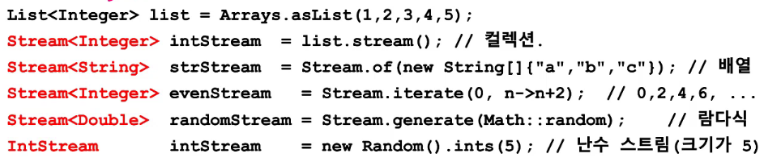

# Steam
* 데이터의 연속적인 흐름

* 다양한 데이터 소스를 표준화된 방법으로 다루기 위한 것

* 컬렉션 : List, Set, Map / 배열을 스트림으로 만들 수 있음
    

* 스트림 작업 단계
    1. 스트림 만들기
    2. 중간 연산 (0~n번 가능)
    3. 최종 연산 (1번만 가능)

    ```java
    stream.distinct().limit(5).sorted().forEach(System.out::println)
           -----------중간 연산---------/최종 연산
    ```
* 스트림은 데이터를 변경하지 않는다.

* 스트림은 Iterator처럼 일회용이다. (한번 사용하면 다시 생성해야 함)

* 최종 연산 전까지 중간 연산이 수행되지 않는다. - **지연된 연산**
    ```java
    IntStream intSteam = new Random().ints(1, 46);  // 1~45의 무한 스트림
    intStream.distinct().limit(6).sorted().         // 중간 연산
                forEach(i->System.out.print(i+" "));// 최종 연산
    ```

* 스트림은 작업을 내부 반복으로 처리한다.
    ```java
    for(String str : strList)
        System.out.println(str);
                ↓
    stream.forEach(System.out::println);
                ‖
    void forEach(Consumer<? super T> action){
        Objects.requireNonNull(action); // 매개변수의 널 체크

        for(T t : src)  // 내부 반복(for문을 메서드 안으로 넣음)
            action.accept(T);
    }
    ```

* 스트림의 작업을 병렬로 처리 - **병렬 스트림**(멀티쓰레드)
    ```java
    Stream<String> strStream = Stream.of("dd", "aaa", "CC");
    int sum = strStream.parallel()  // 병렬 스트림으로 전환
                    .mapToInt(s->s.length()).sum(); // 모든 문자열 길이의 합
    ```

* 기본형 스트림 - IntStream, LongStream, DoubleStream ...
    * `Stream<T>`의 T는 기본형이 아닌 참조형이기 때문에 1을 new Integer(1)로 써야 한다.

        1 → new Integer(1) : 오토박싱

        new Integer(1) → 1 : 언박싱
    * 기본형 스트림을 사용하면 오토박싱&언박싱의 비효율이 제거된다.

    * 숫자와 관련된 유용한 메서드를 Stream<T>보다 더 많이 제공한다.

    * 보다 효율적인 작업을 위해 주로 사용

# 스트림 만들기
* Collection 인터페이스에 stream()이 정의되어 있음
    > Stream<T> Collection.stream()

* 배열 선언
    ```java
    Stream<T> Stream.of(T[])
    Stream<T> Arrays.Stream(T[])
    ```

* 난수 생성 스트림
    * 무한 스트림이기 때문에 스트림의 크기를 지정해줘야 함.
    ```java
    IntStream intStream = new Random.ints();
    //IntStream intStream = new Random.ints(5); // 유한 스트림
    intStream.limit(5).forEach(System.out::println);

    IntStream intStream = new Random.ints(1, 5); // 1~4 범위
    ```

* iterate(), generate()
    ```java
    static <T>Stream<T> iterate(T seed, UnaryOperator<T> f) // 초기값, 람다식
    static <T>Stream<T> generate(Supplier<T> s) // 람다식
    ```

# 그 외 스트림
* 파일
    ```java
    Stream<Path> Files.list(path.dir)
    ```

* 빈 스트림
    ```java
    Stream emptyStream = Stream.empty();
    ```