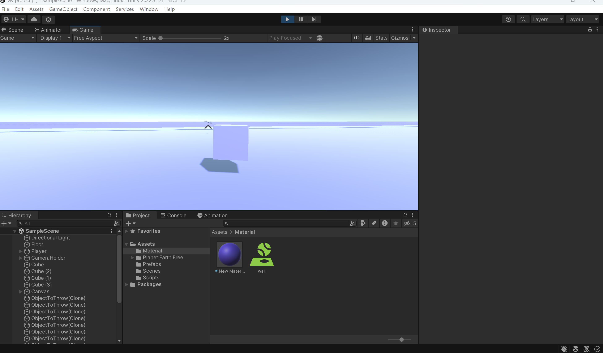

# 유니티 1인칭 이동 및 카메라 설정

## BallMove.cs
* 플레이어 이동 담당

* 상하좌우 + 이동 존재

* 주요 함수
    * `MovePlayer` : `AddForce` 함수를 통해 플레이어에 힘을 줌
    
        점프 시에는 공기저항 계수를 곱하여 이동속도 저하

    * `SpeedControl`
        * 플레이어의 움직임이 힘을 더하는 방식으로 작동하기 때문에 계속해서 힘이 주어질 경우 속도는 무제한으로 빨라짐
        
        * 이를 제한하기 위해 플레이어의 속도를 제한하는 함수

## Throwable.cs
* Prefab을 인스턴스화하여 객체를 쏘는 역할을 담당

## Followcam.cs
* 플레이어를 따라다니는 카메라 담당

* 원래는 TPP 형식의 카메라를 만들려 했지만 구현하는 것에 어려움을 느끼고 1인칭 형식을 먼저 구현

## 한계점 및 개선사항
* 조준선의 위치와 총의 도달 지점이 정확하게 맞지 않음

* 기존 목표대로 3인칭 카메라 구현이 필요

## 참고
* https://www.youtube.com/playlist?list=PLPV2KyIb3jR5QFsefuO2RlAgWEz6EvVi6

* https://www.youtube.com/watch?v=F20Sr5FlUlE